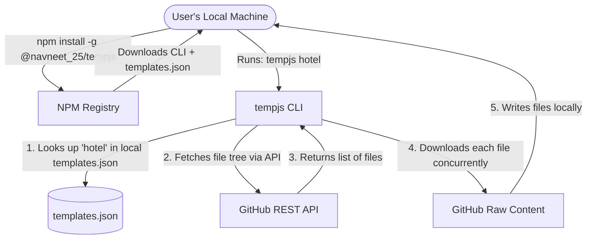

# How `tempjs` Works Under the Hood: A Comprehensive Developer Guide

This guide explains the architecture of the `@navneet_25/tempjs` CLI, what NPM and GitHub each manage, how installation works, and the step-by-step execution flow under the hood.

---

## 1. High-Level Architecture

The CLI is designed to be **lightweight**. Instead of packaging every website template inside the NPM package (which would make the download huge and require constant updates), the CLI downloads templates dynamically from **GitHub** only when needed.



---

## 2. Who Manages What?

### A. NPM Registry (The CLI)
The NPM registry only stores the command-line interface itself and the manifest mapping. 

In `package.json`, the `"files"` array specifies exactly which files get packaged:
```json
"files": [
  "cli",
  "templates.json"
]
```
* **What is uploaded to NPM:**
  * The `cli/` folder (the JavaScript logic).
  * `templates.json` (the list of available templates and repo details).
  * `package.json` and `README.md`.
* **What is excluded from NPM:**
  * The `templates/` folder (containing the heavy website source codes).
  * `.gitignore`, development configurations, etc.
  * **Result:** The NPM package is extremely fast to download and install (around 8.5 KB compressed).

### B. GitHub Repository (The Templates)
GitHub acts as the **source of truth** and hosting platform for the template files.
* **What is stored on GitHub:**
  * The complete codebase, including the `templates/` folder which holds all the individual website templates (e.g., `templates/hotel-website-template`).
  * The CLI code and documentation.

---

## 3. Under the Hood: Step-by-Step Execution

When a user runs `tempjs hotel`, the CLI executes the following steps:

1. **Manifest Lookup:**
   The CLI reads the `templates.json` packaged with the NPM installation to verify if `hotel` exists. It retrieves:
   * The directory name: `hotel-website-template`
   * The GitHub repo owner, repo name, and branch.

2. **Local vs Remote Check:**
   * If running locally in development mode (where the local `templates/` folder exists relative to the CLI script), it copies the files instantly from the disk.
   * Otherwise, it prepares to fetch from GitHub.

3. **Fetch Repository Tree:**
   The CLI queries the GitHub API:
   `GET https://api.github.com/repos/{owner}/{repo}/git/trees/{branch}?recursive=1`
   This returns the entire file tree of the repository without downloading the contents.

4. **Filter & Select Files:**
   The CLI filters the file tree to select only blobs whose paths start with `templates/hotel-website-template/`.

5. **Concurrently Download Blobs:**
   The CLI spins up **8 concurrent workers** (as defined in `fetch.js` concurrency settings) to download the matching files asynchronously.
   * For files under 1MB, it uses the GitHub Blobs API.
   * For larger files, it streams directly from `https://raw.githubusercontent.com`.

6. **Safety Cleanups & Verification:**
   * Files are initially downloaded into a secure system temporary directory (e.g., `tmpdir()/template-cli-xxxxxx`).
   * It excludes `.git/` directories and sensitive configuration files like `.env` (keeping `.env.example`).
   * Once successfully downloaded, it copies the clean templates into the user's current directory (prompting if files will be overwritten, unless `--force` is used).

---

## 4. Workflow: Adding a New Template

If you create a new template (e.g., `restaurant`), do you need to publish to NPM again? **Yes, but only to update the manifest.**

Here is the exact process:

### Step 1: Create the template folder
Add your template directory under the `templates/` root on your local filesystem (e.g., `templates/restaurant-website-template/`).

### Step 2: Update the local `templates.json`
Add the new entry under `"templates"` in `templates.json`:
```json
"restaurant": {
  "directory": "restaurant-website-template",
  "name": "Restaurant Website",
  "description": "Modern restaurant website template"
}
```

### Step 3: Push to GitHub
Commit and push your template code and the updated `templates.json` to your GitHub repository:
```bash
git add .
git commit -m "Add restaurant website template"
git push origin main
```
> [!IMPORTANT]
> The template files **must** be live on GitHub because the CLI fetches them from the remote repository during production use.

### Step 4: Publish to NPM
Since the installed CLI looks at the **locally installed** `templates.json` to map command names, you must update the package version and publish to NPM:
```bash
# Bump version (e.g. from 1.0.0 to 1.0.1)
npm version patch

# Publish the update
npm publish --access public
```
Once published, users who update their CLI (`npm update -g @navneet_25/tempjs`) will be able to run `tempjs restaurant` immediately.

---

## 5. Crucial Setup Step

In your `templates.json`, the `"repository"` settings currently point to placeholders:
```json
"repository": {
  "owner": "your-username",
  "repo": "templates",
  "branch": "main",
  "templatesPath": "templates"
}
```

Make sure to edit `templates.json` to replace `"your-username"` and `"templates"` with your actual GitHub username and repository name so that the CLI fetches templates from the correct place automatically!
