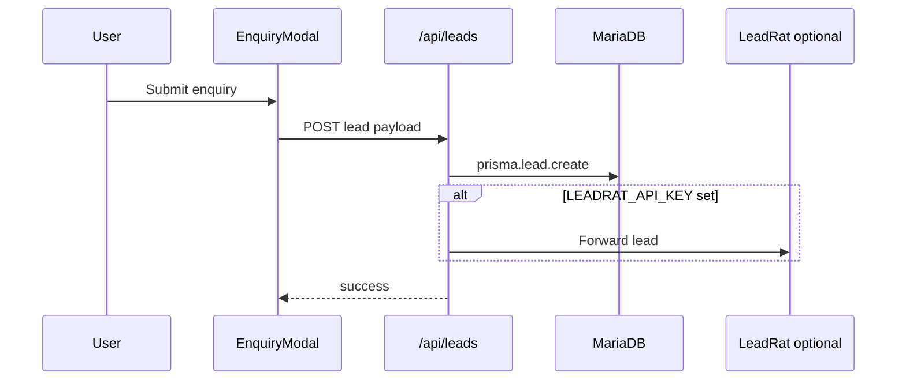

# Architecture — Hotel template

One-page map for developers customizing a client site.

## Folder map

```
app/
  page.tsx                 # Home — hero, room grid, facilities, reviews
  [slug]/                  # Room detail pages (slug from room name)
  gallery/                 # Full-screen photo gallery
  admin/                   # Protected admin UI (NextAuth)
  api/
    health/                # GET — DB + env probe
    leads/                 # POST — enquiry submissions
    room-types/            # CRUD for rooms (admin)
    facilities/            # CRUD for amenities
    reviews/               # CRUD for guest reviews
    hotel-config/          # Site config blobs
    promo-banner/          # Hero/promo banner assets
constants/
  site.ts                  # ★ Brand, SEO, theme, hero copy — customize first
  default-room-types.ts    # Fallback room data (also used by seed)
  default-facilities.ts
  default-reviews.ts
lib/
  features/                # ★ Domain modules (controller / service / repository)
    room-types/
    facilities/
    reviews/
    hotel-config/
  database/prisma.ts       # Prisma client
  features/leads/          # Lead capture + optional LeadRat forward (from core)
  storage/                 # Local + FTP upload helpers
prisma/
  schema.prisma            # Merged: core Lead/PromoBanner + hotel models
  seed.ts                  # Seeds rooms, facilities, reviews
public/
  hero/                    # Default hero / gallery images
  logo.svg
```

## Where admin lives

- **Login:** `/admin/login` → credentials from `.env` (`ADMIN_USER` / `ADMIN_PASSWORD`).
- **Dashboard:** `/admin` — tabs for rooms, facilities, reviews, leads, promo banner.
- **Auth:** `auth.ts` + NextAuth credentials provider; session JWT.
- **API routes** under `app/api/*` back the admin forms and public enquiry modal.

## How leads flow



Leads are **always stored locally**. CRM sync is optional when `LEADRAT_API_KEY` is set.

## Adding a new public page

1. Create `app/your-page/page.tsx` (App Router).
2. Add nav link in `app/components/Navbar.tsx` or extend `SITE.navigation` in `constants/site.ts`.
3. Reuse `EnquiryModal`, `Navbar`, `Footer` from existing pages.
4. For CMS-backed content, add a Prisma model + admin form (follow `facilities` or `reviews` as a pattern).

## Adding a new room type

- **Quick:** Edit `constants/default-room-types.ts` and re-run `pnpm prisma db seed`.
- **Production:** Use **Admin → Rooms** or POST to `/api/room-types`; detail page auto-generates at `/[slug]`.

## Health & monitoring

`GET /api/health` returns env presence, optional feature flags, and `SELECT 1` against the database. Use for local debugging and production probes.
