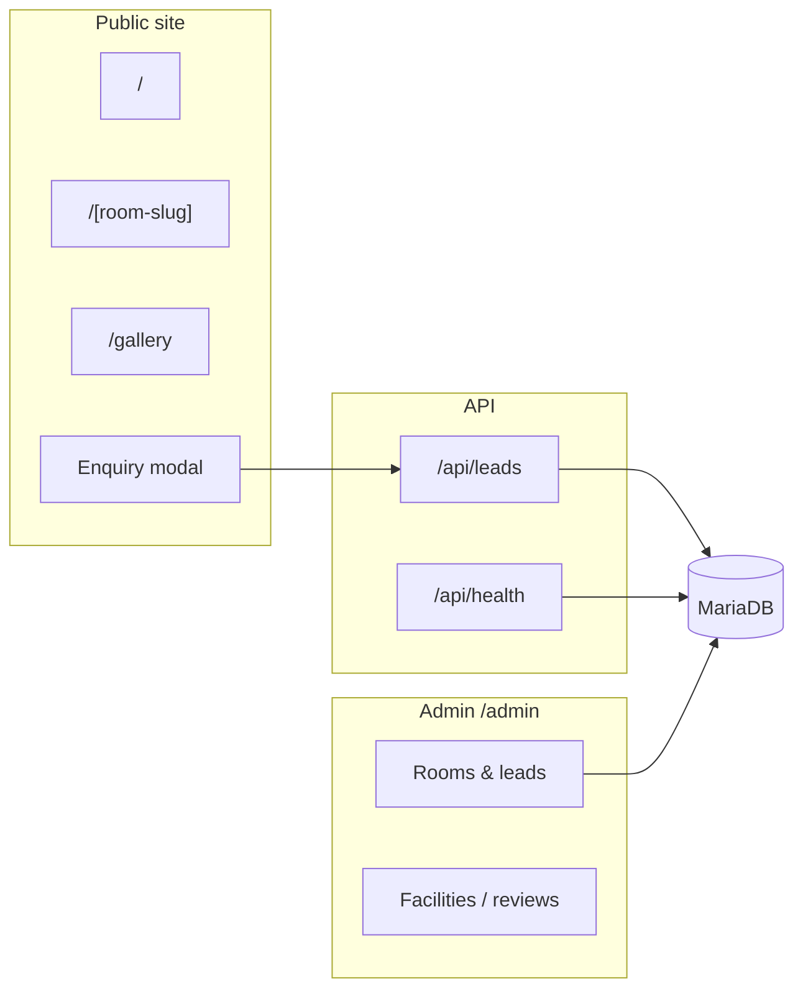

# Lakeside Haven Resort — Hotel Website

Demo resort site for **Lakeside Haven** (Lonavala). Built with Next.js 16, Prisma, and a full admin portal for rooms, facilities, reviews, and leads.

## Architecture at a glance



## 5-minute setup

**Prerequisites:** Node 20+, pnpm 10+, Docker (optional for local DB).

See **[GETTING_STARTED.md](./GETTING_STARTED.md)** for the full checklist.

```bash
pnpm install
cp .env.example .env          # edit DATABASE_URL, AUTH_SECRET, admin credentials
docker compose up -d          # local MariaDB — or use tempjs init-db
pnpm prisma db push
pnpm prisma db seed           # demo rooms, facilities, reviews
pnpm dev
```

Verify: `curl http://localhost:3000/api/health` → `status: "ok"` when DB and env are set.

## Admin portal

| | |
|---|---|
| **URL** | `http://localhost:3000/admin` |
| **Login** | Values from `.env`: `ADMIN_USER` / `ADMIN_PASSWORD` |
| **Default in `.env.example`** | `admin` / `change_this_password` |

After login you can manage room types, facilities, guest reviews, promo banners, and export leads.

## What to customize first

1. **`constants/site.ts`** — brand name, contact, SEO, hero copy, theme colors, navigation labels.
2. **`.env`** — `DATABASE_URL`, `AUTH_SECRET`, admin credentials; optional `FTP_*` and `LEADRAT_API_KEY`.
3. **`app/components/Hero.tsx`** — carousel images and layout (copy mostly comes from `SITE.hero`).
4. **`public/`** — replace `logo.svg`, hero images under `public/hero/`.
5. Run `tempjs brand` or edit `constants/site.ts` then `pnpm prisma db seed` for fresh demo data.

## Docs

| File | Purpose |
|------|---------|
| [GETTING_STARTED.md](./GETTING_STARTED.md) | Linear setup checklist |
| [ARCHITECTURE.md](./ARCHITECTURE.md) | Folder map, admin, leads flow |
| [DEVELOPER_GUIDE.md](./DEVELOPER_GUIDE.md) | Deep dive: FTP, LeadRat, deployment |

## Stack

Next.js 16 · React 19 · TypeScript · Tailwind CSS 4 · Prisma 7 · MariaDB · NextAuth v5

Generated with [tempjs](https://github.com/SidhartGautam25/templates).
