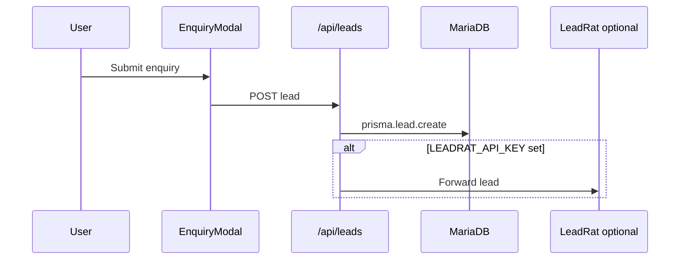

# Architecture — Real estate template

One-page map for developers customizing a client site.

## Folder map

```
app/
  page.tsx                 # Home — hero, property grid, about, enquiry
  [slug]/                  # Property detail pages (slug from project name)
  admin/                   # Protected admin UI
  api/
    health/                # GET — DB + env probe
    leads/                 # POST — enquiry submissions
    projects/              # CRUD for property listings
    promo-banner/          # Promo strip assets
constants/
  site.ts                  # ★ Brand, RERA, SEO, theme, hero — customize first
  default-projects.ts      # Demo listings (seed source)
lib/
  database/prisma.ts
  features/leads/          # Lead capture + optional LeadRat
  storage/                 # Local + FTP uploads
  utils/slugify.ts         # URL slugs for /[slug] routes
prisma/
  schema.prisma            # Project, Lead, PromoBanner, SiteConfig…
  seed.ts                  # Seeds default-projects
public/
  logo.svg
  assets/                  # Placeholder listing images
```

## Where admin lives

- **Login:** `/admin/login` — `ADMIN_USER` / `ADMIN_PASSWORD` from `.env`.
- **Dashboard:** `/admin` — property listings, leads table, promo banner, launch logo.
- **Auth:** NextAuth credentials in `auth.ts`.

## How leads flow



Leads are stored locally first. CRM forwarding is optional.

## Adding a new public page

1. Add `app/your-page/page.tsx`.
2. Link from `Navbar` or `SITE.navigation` in `constants/site.ts`.
3. Reuse `EnquiryModal`, `Navbar`, `Footer`.

## Adding a new property listing

- **Seed / defaults:** Edit `constants/default-projects.ts`, then `pnpm prisma db seed`.
- **Admin:** Use **Admin → Properties** or `/api/projects`.
- **Public URL:** Auto at `/[slugified-name]` via `app/[slug]/page.tsx`.

## Health & monitoring

`GET /api/health` — use for local `tempjs doctor` and production uptime checks.
