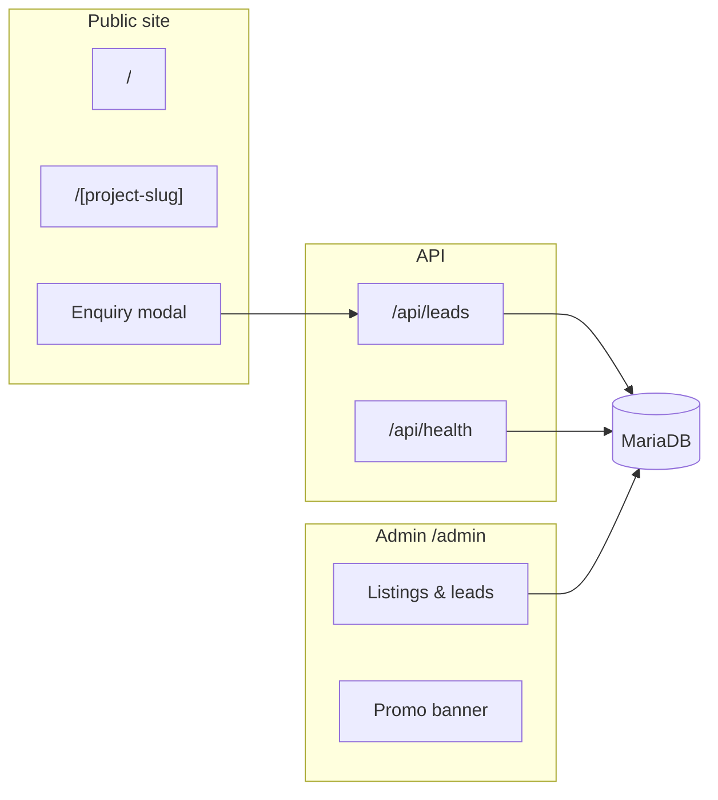

# Greenfield Properties — Real Estate Website

Demo property-listing site for **Greenfield Properties** (Pune). Next.js 16 app with admin portal for listings, leads, and promo content.

> Run `pnpm dev` and open `http://localhost:3000` — featured listings, project detail pages, and enquiry flows are pre-seeded.

## Architecture at a glance



## 5-minute setup

**Prerequisites:** Node 20+, pnpm 10+, Docker (optional for local DB).

See **[GETTING_STARTED.md](./GETTING_STARTED.md)** for the full checklist.

```bash
pnpm install
cp .env.example .env
docker compose up -d          # or tempjs init-db
pnpm prisma db push
pnpm prisma db seed           # demo property listings
pnpm dev
```

Verify: `curl http://localhost:3000/api/health` → `status: "ok"` when DB and env are set.

## Admin portal

| | |
|---|---|
| **URL** | `http://localhost:3000/admin` |
| **Login** | `ADMIN_USER` / `ADMIN_PASSWORD` from `.env` |
| **Default in `.env.example`** | `admin` / `change_this_password` |

Manage property listings, leads export, launch logos, and promo banners from the dashboard.

## What to customize first

1. **`constants/site.ts`** — developer brand, contact, RERA text, SEO, hero, theme colors.
2. **`.env`** — database, auth secret, admin credentials; optional FTP and LeadRat.
3. **`constants/default-projects.ts`** — demo listings (also used by seed).
4. **`app/components/Hero.tsx`** — hero imagery and CTA layout.
5. **`public/logo.svg`** and listing placeholder images.

## Docs

| File | Purpose |
|------|---------|
| [GETTING_STARTED.md](./GETTING_STARTED.md) | Linear setup checklist |
| [ARCHITECTURE.md](./ARCHITECTURE.md) | Folder map, admin, leads flow |
| [DEVELOPER_GUIDE.md](./DEVELOPER_GUIDE.md) | FTP, LeadRat, deployment |

## Stack

Next.js 16 · React 19 · TypeScript · Tailwind CSS 4 · Prisma 7 · MariaDB · NextAuth v5

Generated with [tempjs](https://github.com/SidhartGautam25/templates).
